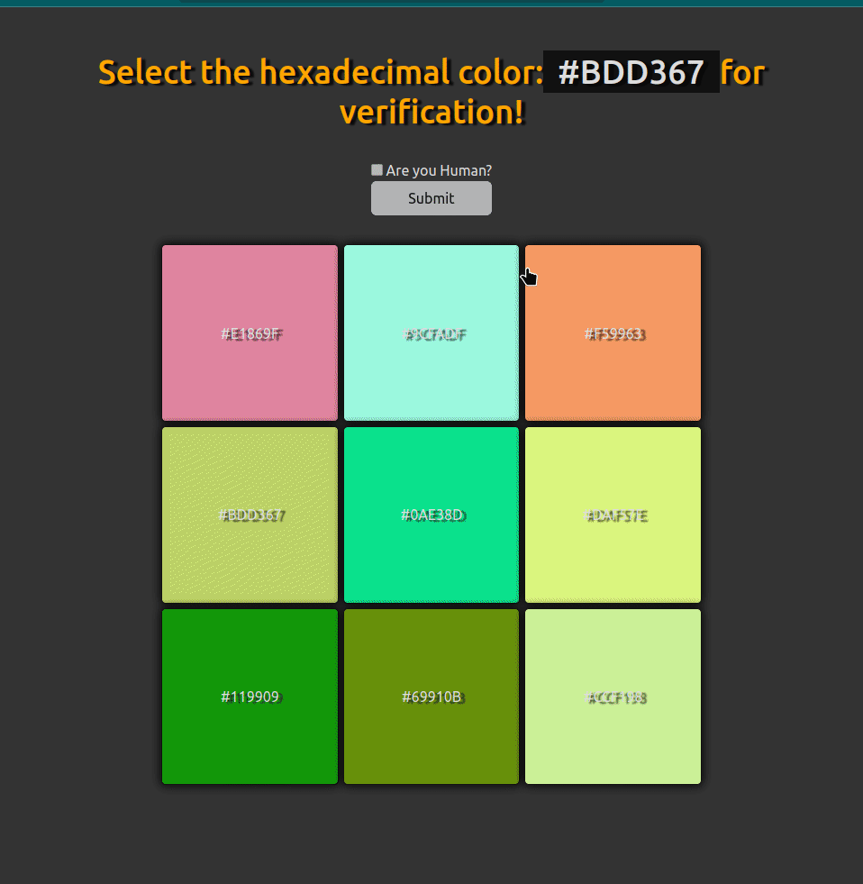

# I am Not a Robot Verification Project

This is a straightforward verification project that challenges you to choose the correct hexadecimal color to prove that you are a human and not a robot.

## Functionality

The project includes the following features:

- It generates random hexadecimal colors and displays them within HTML `
` elements with the class `.element`.
- It selects a random color and displays it within a `` element inside the `<h1>`.
- Users are required to click on the correct color from the list of generated colors to enable a submit button.
- A checkbox allows users to confirm their humanity.
- If the user selects the correct color and checks the checkbox, the submit button becomes enabled for use.

## Code

The project utilizes HTML, CSS, and JavaScript to achieve its functionality. Here is a brief overview of the code:

- `index.html`: Contains the HTML structure of the project.
- `style.css`: Defines CSS styles for the project.
- `main.js`: Contains JavaScript code responsible for generating random colors, managing color selection, verifying the user's humanity, and enabling the submit button.

## Usage

To run the project, simply open the `index.html` file in your web browser. Follow the instructions provided on the page to complete the verification.

## Credits

This project serves as a simple example of captcha verification using HTML, CSS, and JavaScript. It was created for educational and demonstrational purposes.

## License

This project is open source and is distributed under the Apache License 2.0. You are welcome to use, modify, and distribute this project as per your requirements.

---

# I am Not a Robot Verification Project

Este es un proyecto de verificación simple que te desafía a seleccionar el color hexadecimal correcto para demostrar que eres un humano y no un robot.

## Funcionalidad

El proyecto consiste en lo siguiente:

- Genera colores hexadecimales aleatorios y los muestra en elementos HTML `
` con la clase `.element`.
- Elige un color aleatorio y lo muestra en un elemento `` dentro del elemento `<h1>`.
- Los usuarios deben hacer clic en el color correcto de la lista de colores generados para habilitar un botón de envío.
- Un checkbox permite a los usuarios confirmar que son humanos.
- Si el usuario selecciona el color correcto y marca el checkbox, el botón de envío se habilita para su uso.

## Código

El proyecto utiliza HTML, CSS y JavaScript para lograr su funcionalidad. Aquí hay una breve descripción del código:

- `index.html`: Contiene la estructura HTML del proyecto.
- `style.css`: Define estilos CSS para el proyecto.
- `main.js`: Contiene el código JavaScript que genera colores aleatorios, gestiona la selección de colores, verifica si el usuario es humano y habilita el botón de envío.

## Uso

Para ejecutar el proyecto, simplemente abre el archivo `index.html` en tu navegador web. Sigue las instrucciones proporcionadas en la página para completar la verificación.

## Créditos

Este proyecto es un ejemplo simple de verificación de captcha utilizando HTML, CSS y JavaScript. Fue creado con fines educativos y de demostración.

## Licencia

Este proyecto es de código abierto y se distribuye bajo la licencia Apache License 2.0. Siéntete libre de utilizar, modificar y distribuir este proyecto según tus necesidades.

---

# Demo

