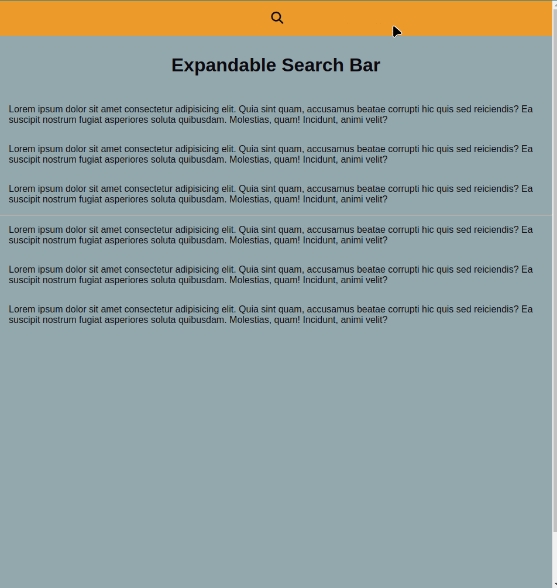

# Expandable Search Bar

This project consists of an expandable search bar that expands upon clicking a button. It uses HTML, CSS, and JavaScript to achieve the desired functionality.

## Screenshots

## Features

- The search bar expands and contracts upon clicking a button.
- Smooth transitions for a pleasant user experience.
- Custom styles for an attractive appearance.

## Usage Instructions

1. Clone this repository to your local machine.
2. Open the `index.html` file in your web browser.
3. Click the search button to expand the bar and perform searches.

## Styles and Design

The CSS file provides attractive and responsive styles for the search bar and other interface elements. Pleasant colors and smooth transitions have been utilized to enhance the overall appearance.

## Demo

